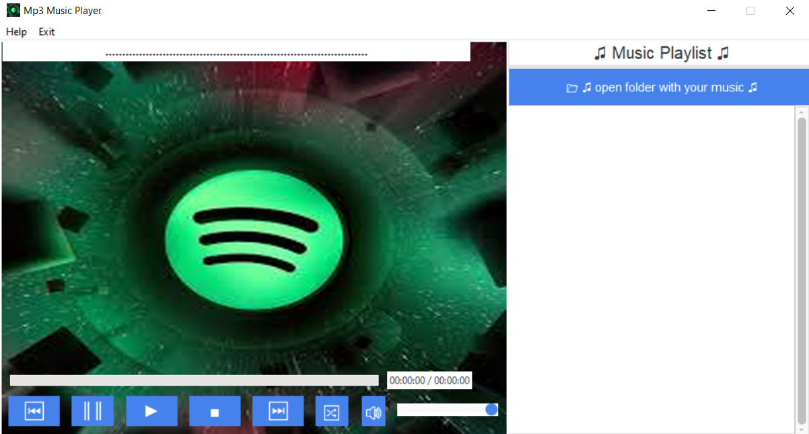

# Python-Mp3-player

# Description
This is a python mp3 player made using Tkinter Gui library.

# Functions
1) Play, Pause, Stop a song
2) Play previous and next song
3) Play all songs
4) Control the volume of song
5) Duration of played song in Progress Bar 
6) Menu bar

# Get Start

To start the program at first you need to install all necessary libraries

you can use this command in terminal: pip install -r requirements.txt

After you successfully installed all libs, you can run the program.